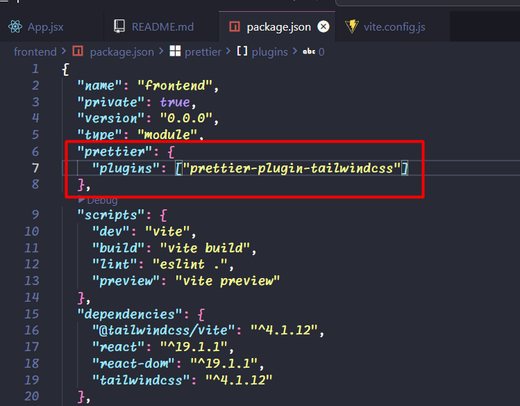
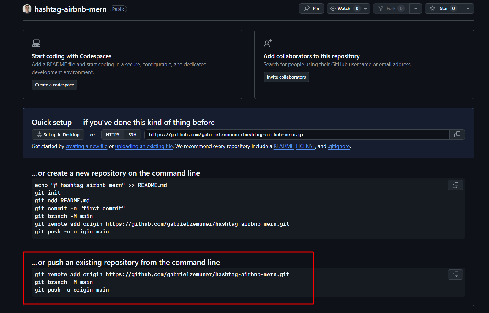

# Aula 1

## Instalação tailwindcss seguindo documentação

```
npm install tailwindcss @tailwindcss/vite
```

configurar arquivo `vite.config.js`, conforme documentação

## Plugin para organizar ordem dos códigos tailwindcss

```
npm install -D prettier prettier-plugin-tailwindcss
```

### Obs: necessário configurar um arquivo prettier separado, ou dentro do package.json configurar o prettier



## Biblioteca de ícones heroicons

```
npm install @heroicons/react
```

# Aula 2

## Versionamento de código - github

### Repositório `hashtag-airbnb-mern`



Inicializar um repositório git no projeto do vscode a pasta raiz do projeto

```
git init
```

Criar arquivo .gitignore

```
git add .
```