# Aula 1

## Instalação tailwindcss seguindo documentação

```
npm install tailwindcss @tailwindcss/vite
```

configurar arquivo `vite.config.js`, conforme documentação

## Plugin para organizar ordem dos códigos tailwindcss

```
npm install -D prettier prettier-plugin-tailwindcss
```

### Obs: necessário configurar um arquivo prettier separado, ou dentro do package.json configurar o prettier


## Biblioteca de ícones heroicons

```
npm install @heroicons/react
```

# Aula 2

## Versionamento de código - github

### Repositório `hashtag-airbnb-mern`


Inicializar um repositório git no projeto do vscode a pasta raiz do projeto

```
git init
```

Criar arquivo .gitignore

```
git add .
git commit -m "mensagem"
```

Após o commit, os arquivos no repositório do github `hashtag-airbnb-mern` ainda não estão atualizados, pois o repositório local não está conectado com o repositório remoto. Para conectar local com remoto, seguir comandos abaixo:

Obs: na primeira tentativa de executar os comandos abaixo, necessário um passo anterior -> configuração do usuário

```
git config --global user.name "Gabriel Zemuner"
git config --global user.email "gabrielzemuner@live.com"
```

Após configuração do usuário, executar comandos abaixo:

```
git remote add origin https://github.com/gabrielzemuner/hashtag-airbnb-mern.git
git branch -M main
git push -u origin main // depois podemos usar apenas o comando git push
```

### Tratamento de responsividade dos componentes

### Instalação react-router

```
npm i react-router
```

#### Configuração react-router

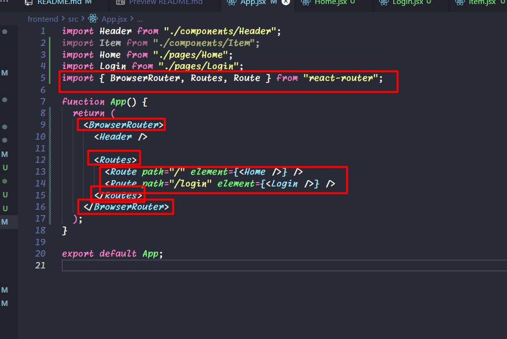

# Aula 3

## Configuração de fonte personalizada (airbnb)

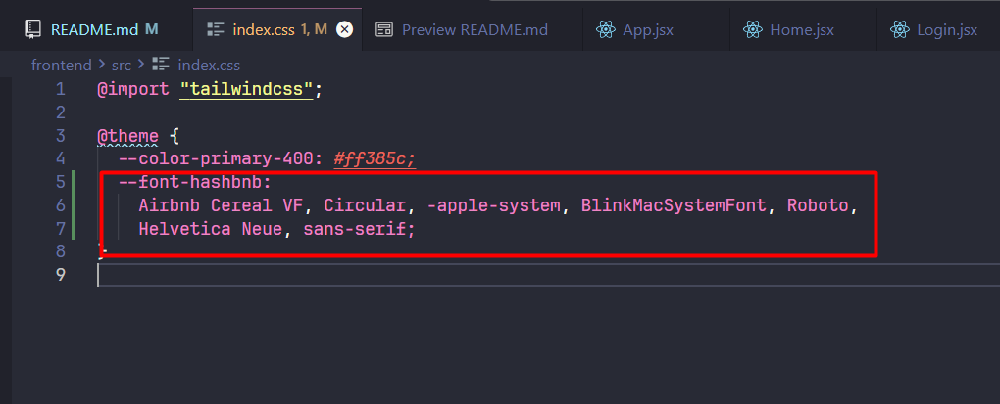

Após configurar CSS, configurar no arquivo index.html

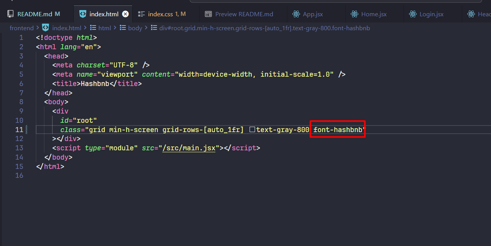

## Backend Node Express

Na pasta do backend, criar um arquivo package.json

```
cd backend
npm init -y
```

Incluir no arquivo package.json a chave type e valor module

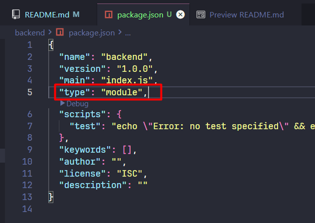

```
npm i express
```

Criar arquivo `index.js` na pasta backend. Esse arquivo irá inicializar a API do projeto

Configurado comando `npm run dev` no arquivo package.json

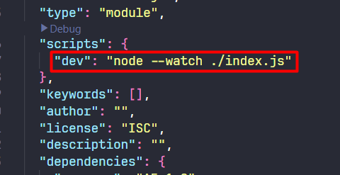

Configurar arquivo `index.js`

Criar arquivo `.env` e configurar a porta do projeto

Instalar dependência pra trabalhar com arquivos `.env` no javascript

```
npm i dotenv
```

No arquivo `index.js`, conseguimos utilizar as variáveis de ambiente (env) através do process.env (retorna um objeto). Para isso, precisamos importar conforme abaixo:

```js
import "dotenv/config";

...
```

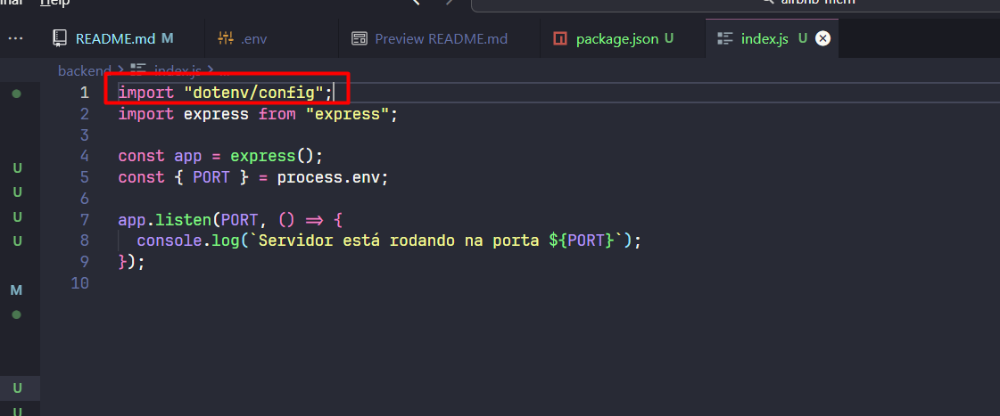

Criado uma rota get no arquivo `index.js`

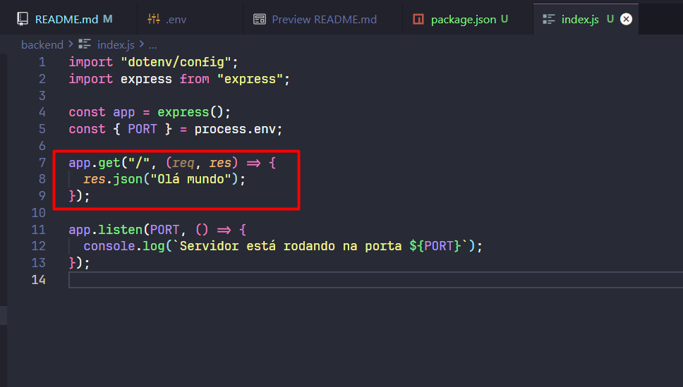

## Banco de dados Mongo

### Configurações dentro da plataforma mongodb:

- Criar projeto

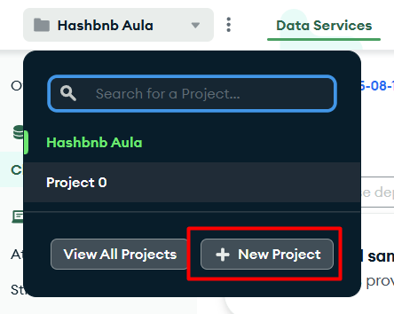

- Criar cluster

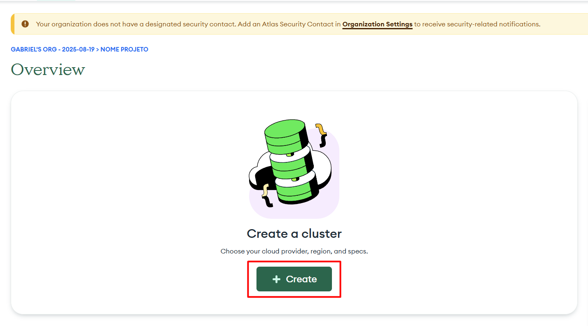

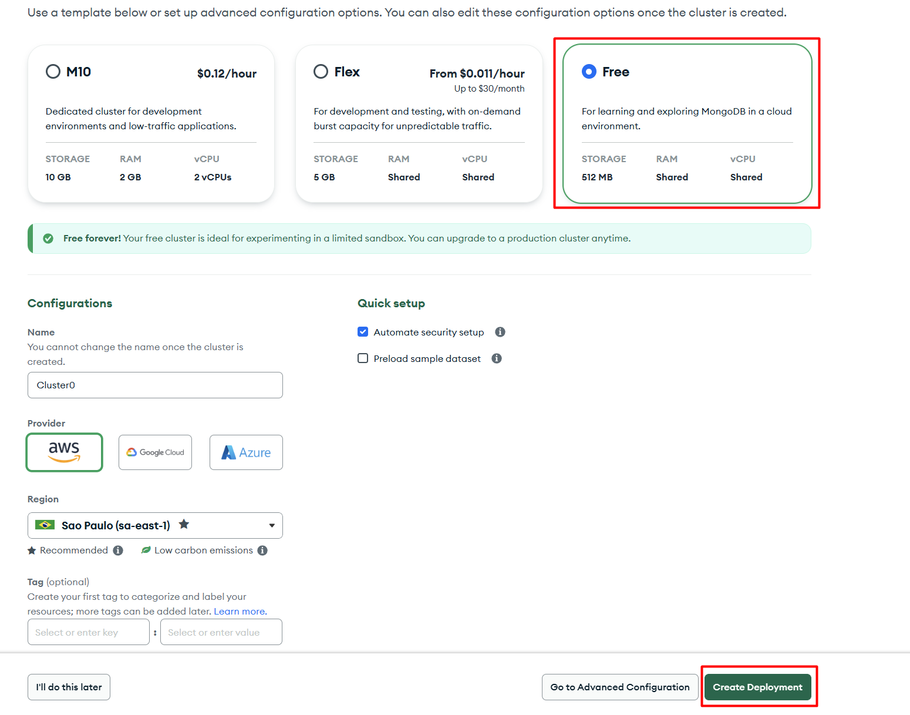

- Copiar dados de acesso (usuário e senha) e depois selecionar `Create Database User` -> `Choose a connection method` -> `Drivers` -> `Done`

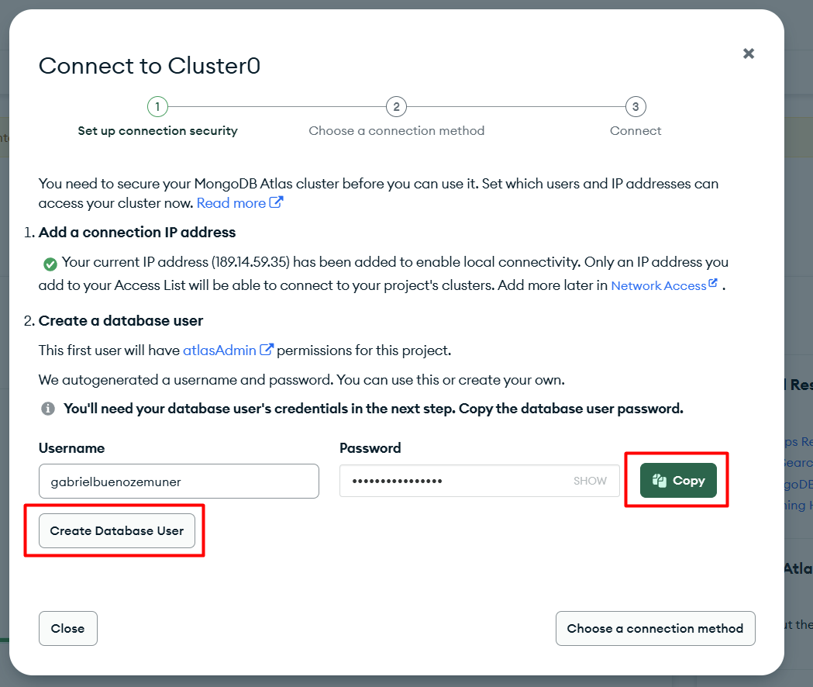

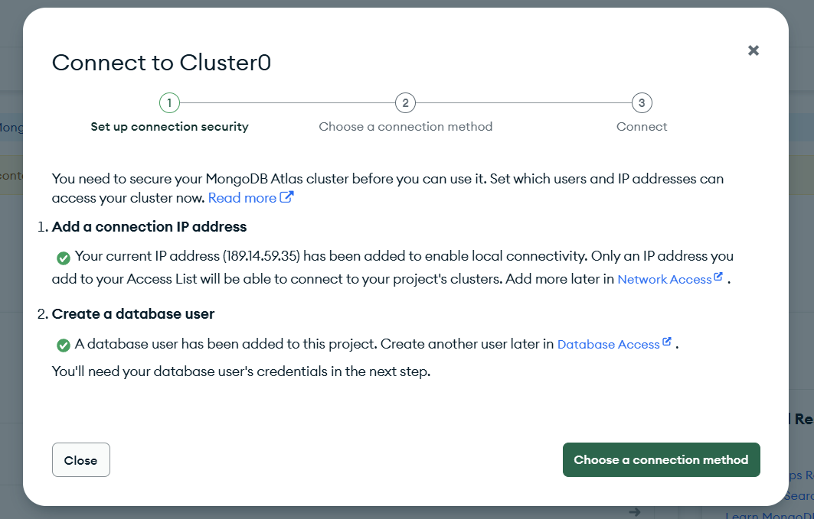

- Liberar acesso IP's 

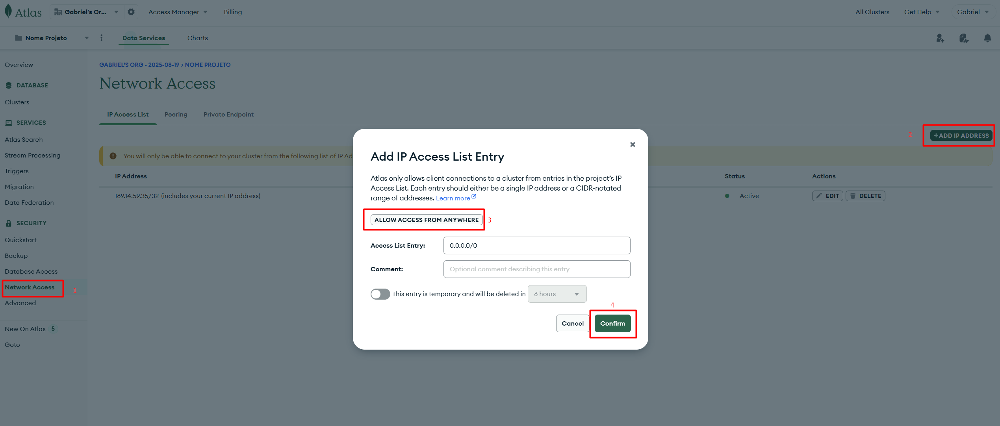

- Na página `cluster`, clicar em `Connect` -> `Drivers` e copiar o código para uma variável dentro do arquivo `.env` 

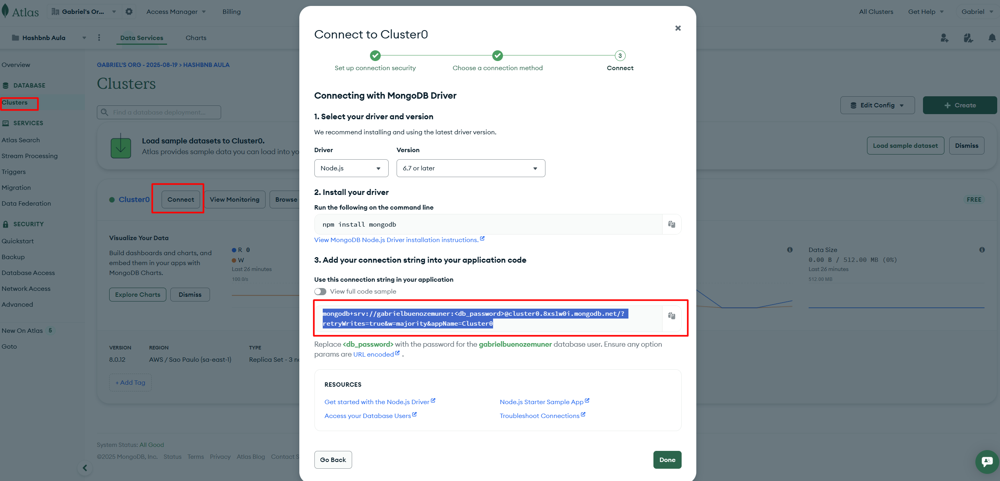

- Criar banco dentro da plataforma mongodb clicando em `Browse Collections` -> `Add My Own Data`

- Com o banco criado (no nosso exemplo `hashbnb`), utilizar na variável MONGO_URL no arquivo `.env` -> '...mongodb.net/`hashbnb`?...'

```
MONGO_URL = mongodb+srv://gabrielbuenozemuner:<db_password>@cluster0.8xs1w0i.mongodb.net/hashbnb?retryWrites=true&w=majority&appName=Cluster0
```

- Criar um arquivo de configuração `db.js` dentro da pasta backend/config

### Instalação Mongoose para trabalhar com mongodb no javascript

```
npm i mongoose
```

### Models

Models são moldes, formas, "schema" para cadastro de informações no banco

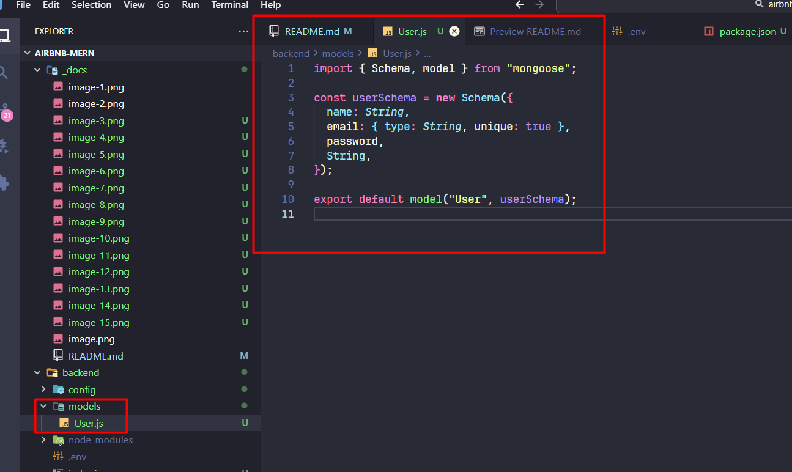


### Rotas

Configurar rota get `/users`. Ao acessar essa rota, foi criado no mongodb uma nova collection users (sem dados). Foi também excluído a collection `user` usada anteriormente.

Criar rota post para cadastrar usuários

Testar método post através do postman (usuário fixo)

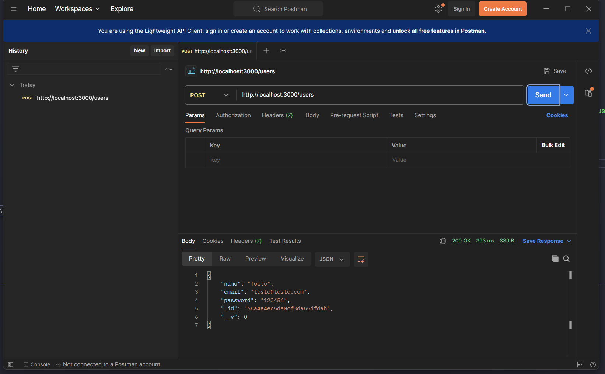

Como não faz sentido utilizar usuário fixo, configurar para buscar os dados da requisição

De:

```js
app.post("/users", async (req, res) => {
  connectDb();

  try {
    const newUserDoc = await User.create({
      name: "Teste",
      email: "teste@teste.com",
      password: "123456",
    });

    res.json(newUserDoc);
  } catch (error) {
    res.status(500).json(error);
  }
});
```

Para:

```js

...
app.use(express.json()); // middleware

app.post("/users", async (req, res) => {
  connectDb();

  const { name, email, password } = req.body;

  try {
    const newUserDoc = await User.create({
      name,
      email,
      password,
    });

    res.json(newUserDoc);
  } catch (error) {
    res.status(500).json(error);
  }
});
```


### Criptografar senha

```
npm i bcryptjs
```

Importar bcryptjs no arquivo `index.js`

### Organizações de código - separação de responsabilidades entre models e arquivo index.js

Criado pasta domains/users -> arquivos: `model.js`, `routes.js`

# Aula 4

## Configurações frontend/backend

Configuração rota login no arquivo `routes.js`

Configurações de estado (useState) no arquivo `Login.jsx`

Instalação axios dentro da pasta frontend para conectar frontend com backend

```
npm i axios
```

Definir URL base do axios no arquivo `App.jsx` -> configurar essa URL em um arquivo `.env`

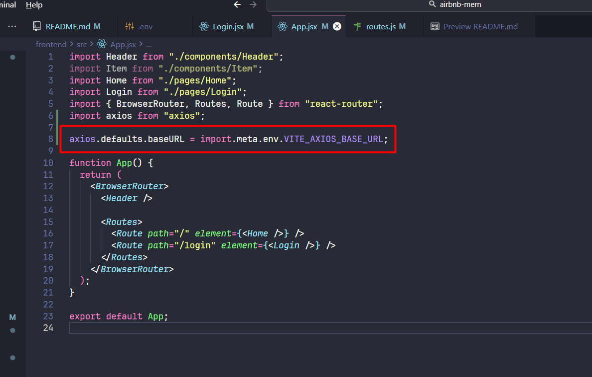

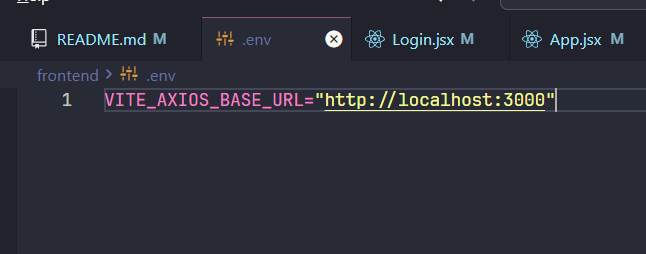


Ao tentar submeter formulário da página `Login.jsx` via axios, erro de CORS:

- Resolução: instalar middleware cors no projeto backend (PASTA BACKEND)

```
npm i cors
```

- Configurar cors no arquivo `index.js` do backend

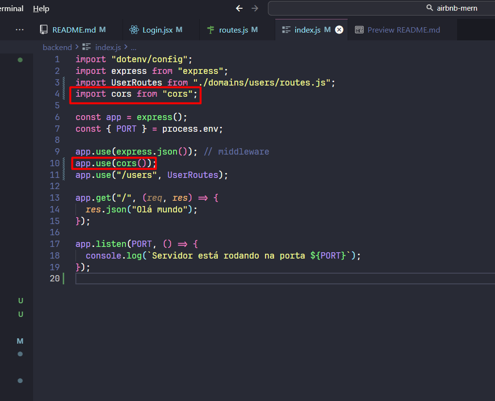

Configurações arquivos `App.jsx`, `Header.jsx` e `Login.jsx`

Criar arquivo `Register.jsx` através da cópia do arquivo `Login.jsx`


# Diferença export default function e export function

Quando exportamos por default, podemos importar determinado arquivo com qualquer nome, ex:

```js
export default function Index() {
    return
}

import Abacaxi from 'components/Index' // isso funcionaria normalmente...
```

Quando exportamos sem o default, precisamos usar a nomenclatura exata de determinada função e com chaves {}, ex:

```js
export const connectDb = () => {}

import { connectDb } from 'pasta/db.js'
```

